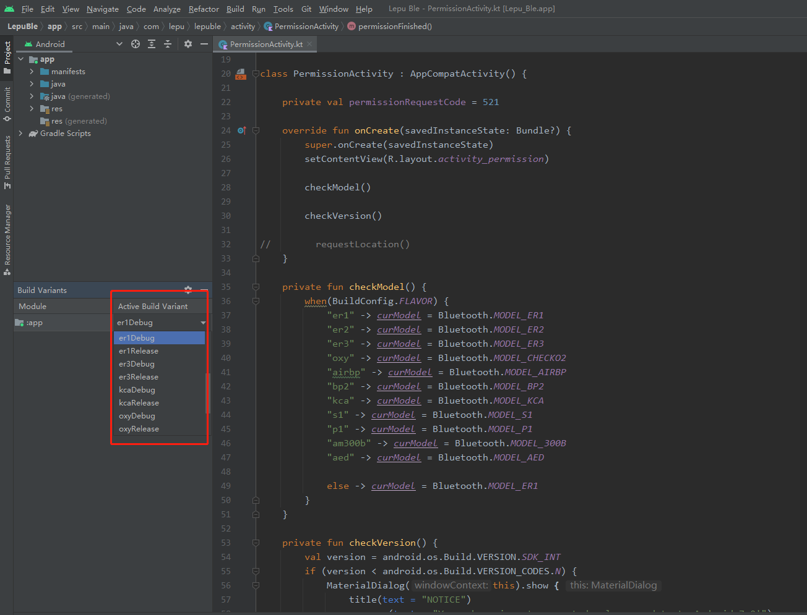

# LepuBle
Thi project is a Android demo for Lepu devices
use `productFlavors` to build for different device

Here is a list of supported devices

| device modle | productFlavors |
| ---- | ---- |
| ER1, ER2, DuoEk | er1 |
| s1 body fat scale | s1 |
| O2 serial: CheckO2, O2Ring, SleepO2 ... | oxy |
| KCA BP monitor | kca |
| BP2 | bp2 |
| Checkme Pro Monitor | monitor |

To debug, use `BuildVariants` -> `Active Build Variant`, then choose the `Variant` like `installEr1Debug`

